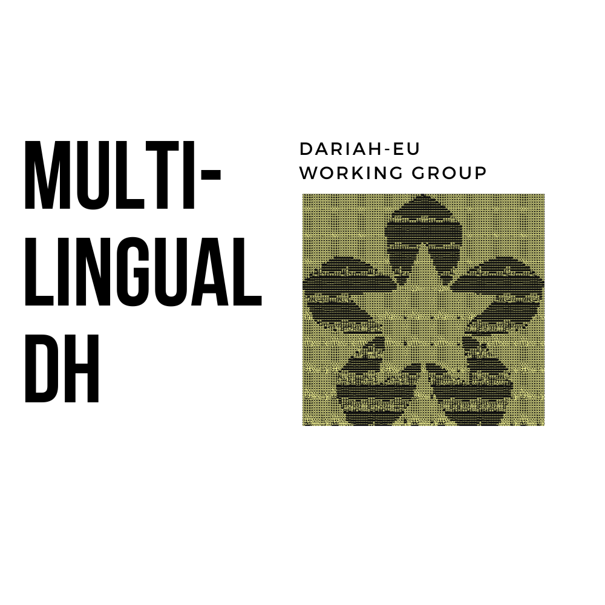
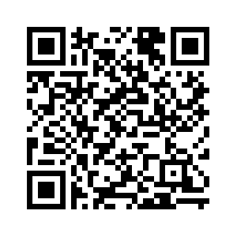

### Göttingen State and University Library, 2025-06-19 
### DARIAH Annual Event 2025 "The Past"
## Creating, Managing and Archiving Textual Corpora in Under-resourced Languages

**Francesco Gelati**, **Alíz Horváth** and **Maroussia Bednarkiewicz**  
DARIAH Working Groups "Research Data Management" and "Multilingual DH" 

License: [Creative Commons BY 4.0](https://creativecommons.org/licenses/by/4.0/)  
[Next slide](02.md)
