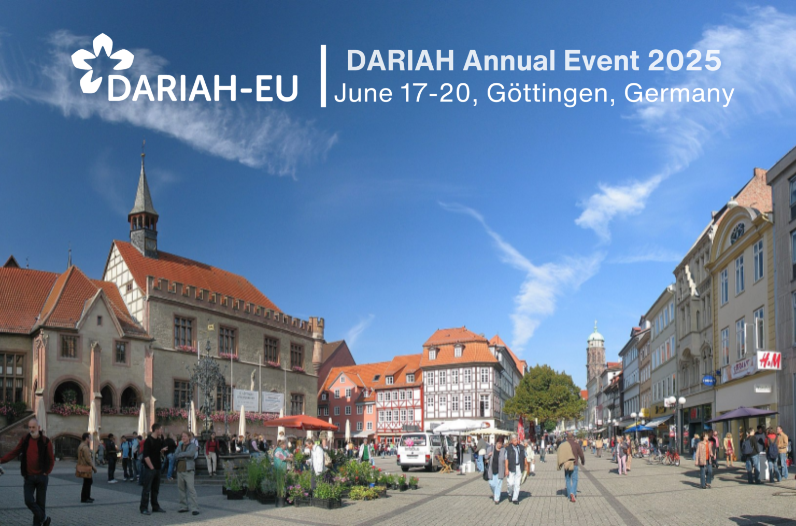

## DARIAH und Göttingen

</a>

Göttingen spielte von 2011 bis 2019 eine zentrale Rolle in allen Projektphasen des deutschen Knotens DARIAH-DE, unterstützte bis 2021 die DARIAH-DE-Betriebskooperation und seit 2021 den Verein Geistes- und Kulturwissenschaftliche ForschungsInfrastrukturen (GKFI e.V.). Derzeit wird DARIAH-DE von der SUB Göttingen (Koordinationsbüro), der Max Weber Stiftung (Arbeitsstelle der nationalen Koordinatorin Nanette Rißler-Pipka) und der Gesellschaft für wissenschaftliche Datenverarbeitung Göttingen - GWDG (technische Leitung) geleitet.  
Überdies findet die nächste DARIAH-Jahrestagung vom 17. bis zum 20. Juni 2025 in Göttingen statt! Hierfür fallen keine Teilnahmegebühren. Das Tagungsprogramm soll [hier](https://annualevent.dariah.eu/) veröffentlicht werden.

[Next slide](09.md)  
Bildnachweis: Goettingen marketplace with old city hall / Daniel Schwen from https://annualevent.dariah.eu/
