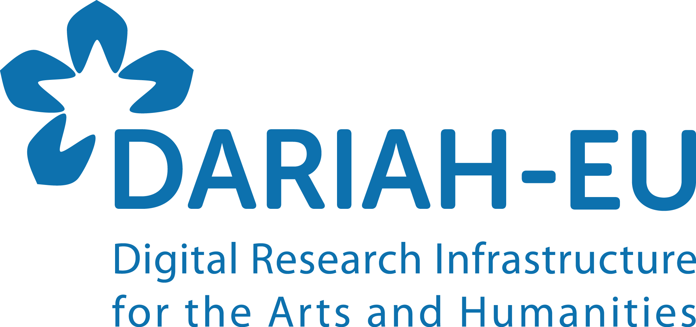
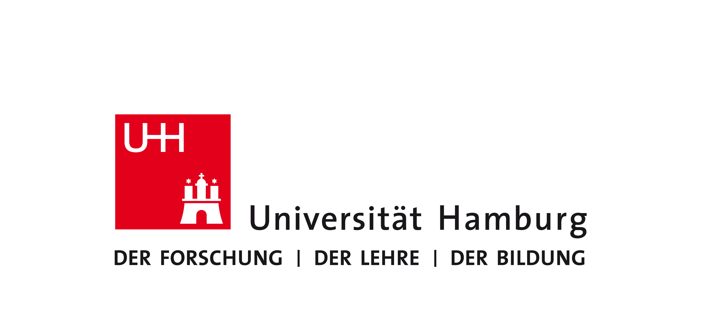

### DARIAH-EU International Workshop "Research Data Management Tools and Strategies for Language Diversity"
## Flash Provocation: What is Research Data Management? 
### University of Edinburgh, 3th-4th September 2026

<a><a href="https://www.uni-hamburg.de/">

**Francesco Gelati**  
University of Hamburg Archives, Head of Section  
DARIAH Working Group "Research Data Management", Co-Chair   

License: [Creative Commons BY 4.0](https://creativecommons.org/licenses/by/4.0/)  
[Next slide](02.md)
