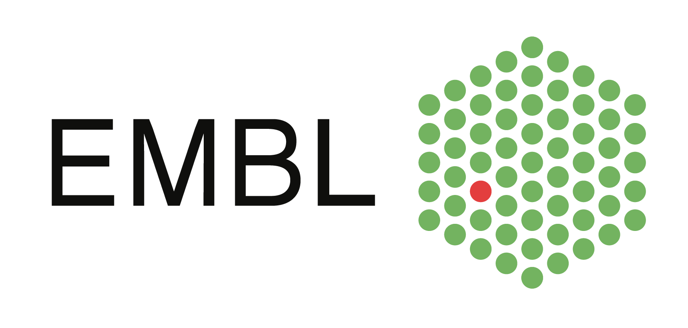

## STARDAST als Konsortium

STARDAST ist der Zusammenschluss von 19 Universitäten, Forschungsinstituten, Unternehmen, europäischen Forschungsinfrastrukturen und internationalen Organisationen aus Deutschland, der Schweiz, den Niederlanden, Finnland, der Türkei, Italien, Frankreich, Tschechien sowie dem Vereinigten Königreich.  
Die Leitung liegt in Heidelberg beim European Molecular Biology Laboratory (EMBL). Weitere wichtige Mitglieder sind die Unis Heidelberg, Tübingen und Cambridge, CERN, DARIAH und AstraZeneca.  

[Next slide](04.md)
