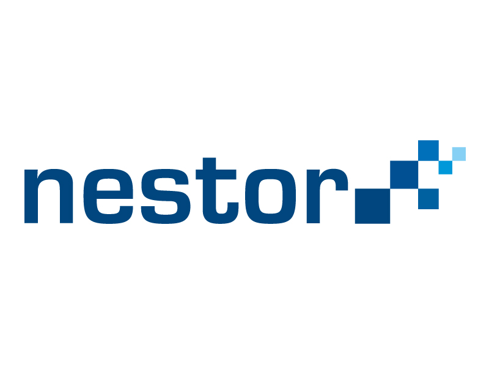

## Appraisal of Research Data

Two parallel initiatives arose in 2025 on archives **appraising** research data. They have been led by *nestor* (Network of Expertise in Long-term Storage of Digital Resources) and by *LAVAH* (Langzeitverfügbarkeit digitaler Inhalte an hessischen Hochschulen). 

Inside the nestor working group on ”Archival Standards”, a pool of archivists was charged of drafting a standard on "Processes and Criteria for the appraisal of research data". The first draft version should be released in 2027.    

On the other hand, LAVAH guidelines were published in 2025 by E. Hamidy et al. 2025. They propose a three-step workflow including:
- a juridical, organisational check;
- a technical check;
- a check on context and structure.

[next slide](08.md)