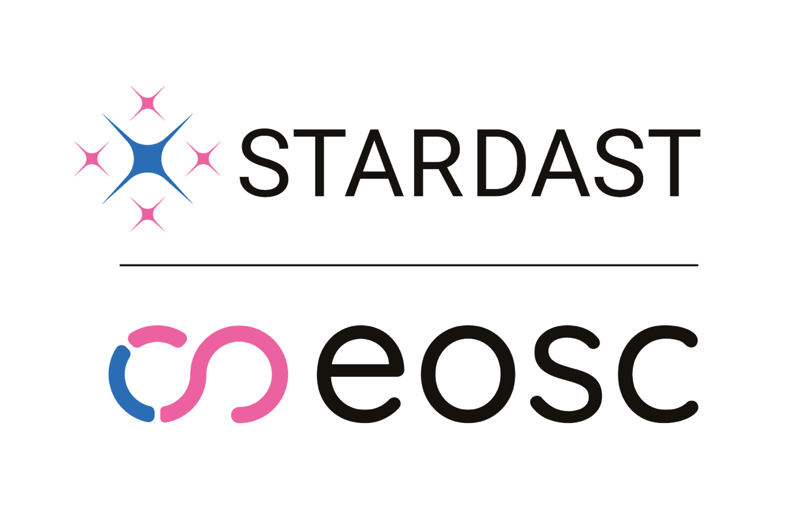

## Data Stewardship in Archives

German archives are more and more paying attention not only to
research data infrastructure and digital preservation, but also to **data stewardship** as a mean of achieving data quality and FAIR principles.  
In fact, the University of Hamburg Archives started in September 2026 the Horizon Europe research project "Stewardship and Recognition for Data Science Talent" (*STARDAST*) in the frame of the European Open Science Cloud (EOSC). Aim of the project is:
- to develop a Europe-wide coordinated curriculum for training data stewards; 
- to standardise certification systems;
- to create an agreed-upon description of data stewardship roles, skills, tasks and competences.

[next slide](09.md)